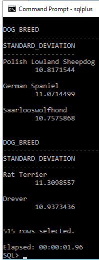

# INFS2200 Assignment, Semester 2 - 2017

## Details
- **Student Number**: 43926871
- **Student Name**: Maxwell Bo
- **DOG_ID**: 988

## Task 1: Constraints

### a)

```
SQL> SELECT OWNER, CONSTRAINT_NAME, TABLE_NAME, SEARCH_CONDITION, INDEX_NAME FROM USER_CONSTRAINTS;

OWNER           CONSTRAINT_NAME      TABLE_NAME                SEARCH_CONDITION     INDEX_NAME
--------------- -------------------- ------------------------- -------------------- --------------------
C##S4392687     PK_STORES            STORES                                         PK_STORES
C##S4392687     PK_DOG_BREEDS        DOG_BREEDS                                     PK_DOG_BREEDS
C##S4392687     PK_SERVICES          SERVICES                                       PK_SERVICES
C##S4392687     PK_DOGS              DOGS                                           PK_DOGS
C##S4392687     PK_SERVICE_HISTORY   SERVICE_HISTORY                                PK_SERVICE_HISTORY
C##S4392687     PK_SHD               SERVICE_HISTORY_DETAIL                         PK_SHD
C##S4392687     NN_PRICE             SERVICES                  PRICE IS NOT NULL
C##S4392687     NN_DOG_NAME          DOGS                      DOG_NAME IS NOT NULL
C##S4392687     FK_DOG_BREED         DOGS
C##S4392687     FK_SH_STORE_ID       SERVICE_HISTORY
C##S4392687     FK_SH_DOG_ID         SERVICE_HISTORY
C##S4392687     FK_SHD_SERVICE_ID    SERVICE_HISTORY_DETAIL
C##S4392687     FK_SERVICE_NAME      SERVICE_HISTORY_DETAIL

13 rows selected.
```

## b)
```
SQL> ALTER TABLE CUSTOMERS ADD CONSTRAINT "PK_CUSTOMERS" PRIMARY KEY (C_ID);

Table altered.
```

```
SQL> ALTER TABLE DOGS ADD CONSTRAINT "FK_C_ID" FOREIGN KEY (C_ID) REFERENCES CUSTOMERS(C_ID);

Table altered.
```

```
SQL> ALTER TABLE SERVICE_HISTORY_DETAIL ADD CONSTRAINT "FK_SHD_SERVICE_ID" FOREIGN KEY (SERVICE_ID) REFERENCES SERVICE_HISTORY(SERVICE_ID);

Table altered.
```

```
SQL> ALTER TABLE CUSTOMERS ADD CONSTRAINT "NN_DOB" CHECK (DOB IS NOT NULL);

Table altered.
```

```
SQL> ALTER TABLE SERVICE_HISTORY ADD CONSTRAINT "CK_FINISHED" CHECK (FINISHED IN ('T', 'F'));

Table altered.
```

```
SQL> ALTER TABLE CUSTOMERS ADD CONSTRAINT "CK_DOB" CHECK (DOB < DATE '1999-01-01');

Table altered.
```

```
SQL> ALTER TABLE SERVICE_HISTORY_DETAIL ADD CONSTRAINT "CK_START_TIME_END_TIME" CHECK (START_TIME < END_TIME);

Table altered.
```

```
SQL> ALTER TABLE SERVICE_HISTORY_DETAIL ADD CONSTRAINT "CK_SERVICE_DATE" CHECK (END_TIME < DATE '2018-01-01');

Table altered.
```

## Task 2: Triggers

### a)
```
SQL> CREATE OR REPLACE TRIGGER "TR_CUSTOMER_ID"

  2  BEFORE INSERT ON CUSTOMERS

  3  FOR EACH ROW

  4  BEGIN

  5  SELECT "SEQ_CUSTOMER".NEXTVAL INTO :NEW.C_ID FROM DUAL;

  6  END;

  7  /


Trigger created.
```

### b)
```
SQL> CREATE OR REPLACE TRIGGER "TR_SERVICE_ID"

  2  BEFORE INSERT ON SERVICE_HISTORY

  3  FOR EACH ROW

  4  BEGIN

  5  SELECT SEQ_SERVICE_HISTORY.NEXTVAL INTO :NEW.SERVICE_ID FROM DUAL;

  6  END;

  7  /


Trigger created.
```

### c)
```
SQL> CREATE OR REPLACE TRIGGER "TR_SERVICE_HISTORY_MESSAGE"

  2  BEFORE INSERT ON SERVICE_HISTORY

  3  FOR EACH ROW

  4  BEGIN

  5  IF :NEW.FINISHED = 'T' THEN

  6     SELECT 'Hi '

  7  || C.F_NAME || ' '

  8  || C.L_NAME || ', your dog '

  9  || D.DOG_NAME || ' of breed: '

 10  || D.DOG_BREED || ' is ready for pick up at '

 11  || S.STORE_AREA || '.'

 12  INTO :NEW.MESSAGE

 13  FROM CUSTOMERS C, DOGS D, STORES S

 14  WHERE C.C_ID = D.C_ID

 15  AND :NEW.STORE_ID = S.STORE_ID

 16  AND :NEW.DOG_ID   = D.DOG_ID;

 17  ELSE

 18  SELECT 'Hi '

 19  || C.F_NAME || ' '

 20  || C.L_NAME || ', your dog '

 21  || D.DOG_NAME || ' of breed: '

 22  || D.DOG_BREED|| ' is not ready to be picked up yet.'

 23  INTO :NEW.MESSAGE

 24  FROM CUSTOMERS C, DOGS D

 25  WHERE C.C_ID = D.C_ID

 26  AND :NEW.DOG_ID = D.DOG_ID;

 27  END IF;

 28  END;

 29  /


Trigger created.
```

### d)

```
SQL> INSERT INTO CUSTOMERS (F_NAME, L_NAME, DOB)

  2  VALUES ('Luke', 'Cheung', '08-OCT-1996');


1 row created.

```

```
SQL> SELECT * FROM CUSTOMERS WHERE F_NAME='Luke' AND L_NAME='Cheung';


      C_ID F_NAME          L_NAME          DOB

---------- --------------- --------------- ---------------

     10000 Luke            Cheung          08-OCT-96

```

```
SQL> INSERT INTO SERVICE_HISTORY (DOG_ID, STORE_ID, FINISHED)

  2  VALUES (1234, 30, 'F');


1 row created.
```

```
SQL> SELECT * FROM SERVICE_HISTORY WHERE DOG_ID=1234 AND STORE_ID=30;


    DOG_ID   STORE_ID SERVICE_ID F MESSAGE

---------- ---------- ---------- - ------------------------------

      1234         30     125000 F Hi Lady Finland, your dog Jack

                                   son of breed: English Foxhound

                                    is not ready to be picked up

                                   yet.


```

## Task 3: Views

### a)

```
SQL> CREATE VIEW "V_DOG_BREED_STATISTICS" AS

  2  SELECT D.DOG_BREED, SUM(S.PRICE) as TOTAL, AVG(S.PRICE) as MEAN, STDDEV(S.PRICE) as STANDARD_DEVIATION

  3  FROM DOGS D, SERVICE_HISTORY SH, SERVICE_HISTORY_DETAIL SHD, SERVICES S

  4  WHERE D.DOG_ID = SH.DOG_ID

  5  AND SH.SERVICE_ID = SHD.SERVICE_ID

  6  AND SHD.SERVICE_NAME = S.SERVICE_NAME

  7  GROUP BY D.DOG_BREED;


View created.

```

### b)

```
SQL> CREATE MATERIALIZED VIEW "MV_DOG_BREED_STATISTICS"

  2  BUILD IMMEDIATE

  3  AS

  4  SELECT D.DOG_BREED, SUM(S.PRICE) as TOTAL, AVG(S.PRICE) as MEAN, STDDEV(S.PRICE) as STANDARD_DEVIATION

  5  FROM DOGS D, SERVICE_HISTORY SH, SERVICE_HISTORY_DETAIL SHD, SERVICES S

  6  WHERE D.DOG_ID = SH.DOG_ID

  7  AND SH.SERVICE_ID = SHD.SERVICE_ID

  8  AND SHD.SERVICE_NAME = S.SERVICE_NAME

  9  GROUP BY D.DOG_BREED;


Materialized view created.

```

### c)




A virtual view is simply another query masquerading as an in-memory table. When the virtual view was queried, the queries were composed together into a combined query, which was then executed. 

When the materialised view was created, its query was immediately executed, and the result of the query was cached (forced by `BUILD IMMEDIATE`) . When the view was queried, the precomputed result was used instead, leading to a lower overall running time when compared to the virtual view.

## Task 4: Function Based Indexes

### a)


### b)

```
SQL> CREATE INDEX "IDX_SERVICE_TIME" ON SERVICE_HISTORY_DETAIL(END_TIME - START_TIME);

Index created.
```

### c)


The index has reduced the running time. A function based index essentially precomputes the given expression for each table row in a table. Queries that use this expression can refer to this index..

## Task 5: Bitmap Indexing

### a)


### b)

```
SQL> CREATE BITMAP INDEX "BIDX_SERVICE" ON SERVICE_HISTORY_DETAIL(SERVICE_NAME);

Index created.
```

### c)


The index has reduced the running time. Before adding the bitmap index, the query needed to go through each row, and check the `SERVICE_NAME` with either a hash function or a string comparison in order to appropriately tally each unique `SERVICE_NAME`. After adding the bitmap index, the tally can be quickly generated by using a aggregation function that sweeps the bitmap. The bitmap has a column for each unique `SERVICE_NAME`, and indicates the row's `SERVICE_NAME` by setting a bit in the appropriate column. 

### d)

The advantages of constructing this bitmap index include dramatically increased performance with queries that perform aggregation.

The disadvantages of constructing this bitmap index include having to reconfigure the bitmap every time a new unique value is introduced to a column,and maintaining the map when altering pre-existing values.

## TASK 6: Execution Plan & Analysis

### a)

```
SQL> SELECT
  2  GET_UNIQUE_SNUMBER(43926871) FROM
  3  DUAL;

GET_UNIQUE_SNUMBER(43926871)
----------------------------
                         988

Elapsed: 00:00:00.01
```

### b)

```
SQL> SELECT INDEX_NAME, COLUMN_NAME, TABLE_NAME
  2  FROM USER_IND_COLUMNS
  3  WHERE TABLE_NAME='STORES' OR TABLE_NAME='SERVICE_HISTORY' OR TABLE_NAME='SERVICE_HISTORY_DETAIL';

INDEX_NAME                     COLUMN_NAME     TABLE_NAME
------------------------------ --------------- ------------------------------
PK_SERVICE_HISTORY             SERVICE_ID      SERVICE_HISTORY
PK_SHD                         SERVICE_ID      SERVICE_HISTORY_DETAIL
PK_SHD                         SERVICE_NAME    SERVICE_HISTORY_DETAIL
BIDX_SERVICE                   SERVICE_NAME    SERVICE_HISTORY_DETAIL
IDX_SERVICE_TIME               SYS_NC00005$    SERVICE_HISTORY_DETAIL
PK_STORES                      STORE_ID        STORES

6 rows selected.
```

### c)


```
SQL> EXPLAIN PLAN FOR (SELECT COUNT(*)
  2  FROM SERVICE_HISTORY SH, SERVICE_HISTORY_DETAIL SHD
  3  WHERE SH.DOG_ID = 988
  4  AND SH.SERVICE_ID = SHD.SERVICE_ID);

Explained.
```

```
SQL> SELECT PLAN_TABLE_OUTPUT FROM TABLE (DBMS_XPLAN.DISPLAY);

PLAN_TABLE_OUTPUT
------------------------------------------------------------------------------------------------------------------------------------------------------
Plan hash value: 2851704051

----------------------------------------------------------------------------------------------------
| Id  | Operation                     | Name               | Rows  | Bytes | Cost (%CPU)| Time     |
----------------------------------------------------------------------------------------------------
|   0 | SELECT STATEMENT              |                    |     1 |    39 |   556   (2)| 00:00:01 |
|   1 |  SORT AGGREGATE               |                    |     1 |    39 |            |          |
|   2 |   NESTED LOOPS                |                    |  2450 | 95550 |   556   (2)| 00:00:01 |
|   3 |    NESTED LOOPS               |                    |   327K| 95550 |   556   (2)| 00:00:01 |
|   4 |     INDEX FAST FULL SCAN      | PK_SHD             |   327K|  4159K|   545   (0)| 00:00:01 |
|*  5 |     INDEX UNIQUE SCAN         | PK_SERVICE_HISTORY |     1 |       |     0   (0)| 00:00:01 |
|*  6 |    TABLE ACCESS BY INDEX ROWID| SERVICE_HISTORY    |     1 |    26 |     0   (0)| 00:00:01 |
----------------------------------------------------------------------------------------------------

Predicate Information (identified by operation id):
---------------------------------------------------

   5 - access("SH"."SERVICE_ID"="SHD"."SERVICE_ID")
   6 - filter("SH"."DOG_ID"=988)

Note
-----

   - dynamic statistics used: dynamic sampling (level=2)

23 rows selected.
```

### d)

```
SQL> ALTER TABLE SERVICE_HISTORY_DETAIL DROP CONSTRAINT PK_SHD;

Table altered.
```

```
SQL> ALTER TABLE SERVICE_HISTORY_DETAIL DROP CONSTRAINT PK_SHD;

Table altered.
```

```
SQL> ALTER TABLE SERVICE_HISTORY DROP CONSTRAINT PK_SERVICE_HISTORY;

Table altered.
```


```
SQL> EXPLAIN PLAN FOR (SELECT COUNT(*)
  2  FROM SERVICE_HISTORY SH, SERVICE_HISTORY_DETAIL SHD
  3  WHERE SH.DOG_ID = 988
  4  AND SH.SERVICE_ID = SHD.SERVICE_ID);

Explained.
```

```
SQL> SELECT PLAN_TABLE_OUTPUT FROM TABLE (DBMS_XPLAN.DISPLAY);

PLAN_TABLE_OUTPUT
------------------------------------------------------------------------------------------------------------------------------------------------------
Plan hash value: 3313643833

----------------------------------------------------------------------------------------------
| Id  | Operation           | Name                   | Rows  | Bytes | Cost (%CPU)| Time     |
----------------------------------------------------------------------------------------------
|   0 | SELECT STATEMENT    |                        |     1 |    39 |  1198   (1)| 00:00:01 |
|   1 |  SORT AGGREGATE     |                        |     1 |    39 |            |          |
|*  2 |   HASH JOIN         |                        |  2450 | 95550 |  1198   (1)| 00:00:01 |
|*  3 |    TABLE ACCESS FULL| SERVICE_HISTORY        |    25 |   650 |   615   (1)| 00:00:01 |
|   4 |    TABLE ACCESS FULL| SERVICE_HISTORY_DETAIL |   327K|  4159K|   582   (1)| 00:00:01 |
----------------------------------------------------------------------------------------------


Predicate Information (identified by operation id):
---------------------------------------------------

   2 - access("SH"."SERVICE_ID"="SHD"."SERVICE_ID")
   3 - filter("SH"."DOG_ID"=988)

Note
-----
   - dynamic statistics used: dynamic sampling (level=2)

21 rows selected.
```

### e)

```
SQL> SELECT HEIGHT, LF_BLKS, BLKS_GETS_PER_ACCESS FROM INDEX_STATS;

    HEIGHT    LF_BLKS BLKS_GETS_PER_ACCESS
---------- ---------- --------------------
         1          1                    2
```

The height of the tree is 1. There is 1 leaf block. Only 2 block accesses are needed for a full direct scan of the `STORES` table.
